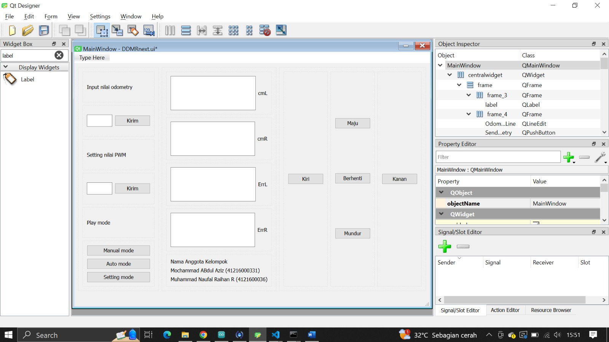
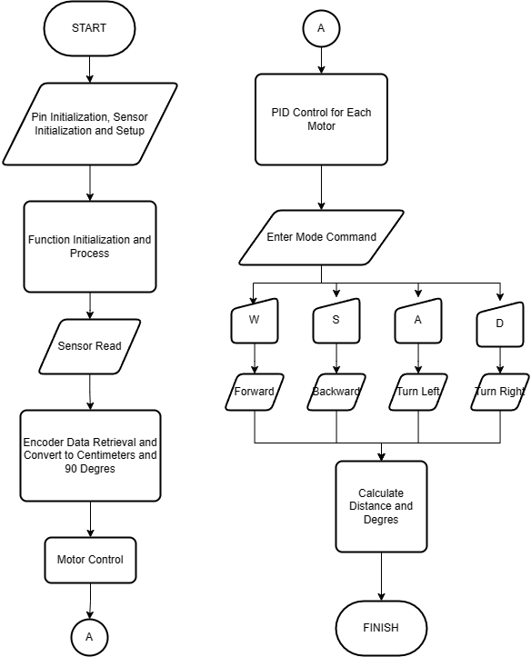

# Table of Contents {#table-of-contents .TOC-Heading}

[1 Introduction and Initial Analysis
[2](#_Toc149728741)](#_Toc149728741)

[1.1 Project Context [2](#project-context)](#project-context)

[1.2 Initial Thought Process
[2](#the-development-of-ddmr-robots-has-been-the-focus-of-research-since-decades-ago.-the-challenge-in-the-development-of-this-robot-is-to-create-a-motion-mechanism-from-two-motors-left-and-right-motors-that-is-efficient-and-adaptable-in-its-environment.-the-development-of-this-robot-is-also-related-to-the-use-of-advanced-sensors-to-improve-its-functionality-because-this-robot-is-widely-applied-in-technological-developments-and-industrial-needs.-one-example-in-our-project-this-ddmr-robot-uses-three-ultrasonic-sensors-and-the-use-of-imu-sensors.-therefore-the-development-of-this-project-is-very-necessary-in-finding-new-innovations-in-its-utilization.)](#the-development-of-ddmr-robots-has-been-the-focus-of-research-since-decades-ago.-the-challenge-in-the-development-of-this-robot-is-to-create-a-motion-mechanism-from-two-motors-left-and-right-motors-that-is-efficient-and-adaptable-in-its-environment.-the-development-of-this-robot-is-also-related-to-the-use-of-advanced-sensors-to-improve-its-functionality-because-this-robot-is-widely-applied-in-technological-developments-and-industrial-needs.-one-example-in-our-project-this-ddmr-robot-uses-three-ultrasonic-sensors-and-the-use-of-imu-sensors.-therefore-the-development-of-this-project-is-very-necessary-in-finding-new-innovations-in-its-utilization.)

[2 Requirement Analysis and Specification
[2](#initial-thought-process)](#initial-thought-process)

[2.1 User Requirements [2](#user-requirements)](#user-requirements)

[2.2 System Requirements
[2](#the-ddmr-robot-will-be-operated-by-students-as-a-learning-module-in-the-mechatronics-system-programming-course.-the-gui-created-will-display-information-on-data-in-real-time.-the-data-information-displayed-are-robot-position-user-defined-target-position-robot-position-error-value-and-ultrasonic-sensors.-the-data-displayed-can-be-used-by-users-to-monitor-and-provide-position-targets-for-ddmr-robots-in-millimeters.)](#the-ddmr-robot-will-be-operated-by-students-as-a-learning-module-in-the-mechatronics-system-programming-course.-the-gui-created-will-display-information-on-data-in-real-time.-the-data-information-displayed-are-robot-position-user-defined-target-position-robot-position-error-value-and-ultrasonic-sensors.-the-data-displayed-can-be-used-by-users-to-monitor-and-provide-position-targets-for-ddmr-robots-in-millimeters.)

[2.3 Tools and Technologies
[2](#tools-and-technologies)](#tools-and-technologies)

[3 Conceptual Design [2](#conceptual-design)](#conceptual-design)

[3.1 System Architecture
[2](#system-architecture)](#system-architecture)

[3.2 Interface Design [2](#interface-design)](#interface-design)

[3.3 Control Algorithm Design
[3](#control-algorithm-design)](#control-algorithm-design)

[4 Detailed Design and Development
[3](#detailed-design-and-development)](#detailed-design-and-development)

[4.1 Component Design [3](#component-design)](#component-design)

[4.2 Coding and Implementation
[3](#coding-and-implementation)](#coding-and-implementation)

[4.3 Integration [3](#integration)](#integration)

[4.4 Unique Features [3](#unique-features)](#unique-features)

[5 Testing, Evaluation, and Optimization
[3](#we-havent-added-any-unique-features-in-this-system-yet.-we-still-use-the-system-of-monitoring-wheel-mileage-error-data-obtained-from-the-encoder-on-the-gui.-the-next-step-we-will-add-monitoring-and-planning-of-ddmr-trajectory.)](#we-havent-added-any-unique-features-in-this-system-yet.-we-still-use-the-system-of-monitoring-wheel-mileage-error-data-obtained-from-the-encoder-on-the-gui.-the-next-step-we-will-add-monitoring-and-planning-of-ddmr-trajectory.)

[5.1 Testing Strategy [3](#testing-strategy)](#testing-strategy)

[5.2 Performance Evaluation [3](#_Toc149728759)](#_Toc149728759)

[5.3 Optimization [3](#_Toc149728760)](#_Toc149728760)

[6 Collaboration and Project Management
[3](#collaboration-and-project-management)](#collaboration-and-project-management)

[6.1 Teamwork Dynamics [3](#teamwork-dynamics)](#teamwork-dynamics)

[6.2 Project Management [3](#project-management)](#project-management)

[7 Conclusion and Reflection
[3](#conclusion-and-reflection)](#conclusion-and-reflection)

[7.1 Project Summary [3](#project-summary)](#project-summary)

[7.2 Future Work [3](#future-work)](#future-work)

[7.3 Personal and Group Reflections
[3](#personal-and-group-reflections)](#personal-and-group-reflections)

[8 Appendices [4](#appendices)](#appendices)

[8.1 Bill of Materials [4](#bill-of-materials)](#bill-of-materials)

[8.2 Electrical Wiring and System Layout
[4](#electrical-wiring-and-system-layout)](#electrical-wiring-and-system-layout)

[8.3 Code Repository [4](#code-repository)](#code-repository)

[8.4 Additional Documentation
[4](#additional-documentation)](#additional-documentation)

[9 References [4](#_Toc149728773)](#_Toc149728773)

[]{#_Toc149728741 .anchor}

# 1 Introduction and Initial Analysis

## 1.1 Project Context

## The development of DDMR robots has been the focus of research since decades ago. The challenge in the development of this robot is to create a motion mechanism from two motors (left and right motors) that is efficient and adaptable in its environment. The development of this robot is also related to the use of advanced sensors to improve its functionality because this robot is widely applied in technological developments and industrial needs. One example in our project, this DDMR robot uses three ultrasonic sensors and the use of IMU sensors. Therefore, the development of this project is very necessary in finding new innovations in its utilization.

## The problem that we have to solve is to provide the features of the DDMR robot that have been provided. These features include the target position of the robot movement by providing a user-defined position point, error detection of the target position that has been determined with the actual conditions, and the utilization of three ultrasonic sensors to detect obstacles.

## The purpose of this project is to gain experience in analyzing a robot that is already available, increase knowledge in programming robotic systems, and increase knowledge in GUI design for monitoring a robot. These things are to improve the abilities possessed by students in the field of mechatronics, especially mechatronics system programming.

## 1.2 Initial Thought Process

## The initial identification that we carried out was to identify every component in the DDMR robot. After that, analyze the schematic series of these components and then think about the concept of providing features to the robot that will be carried out. The initial idea of ​​each stage of the program on the DDMR robot is to move the robot with a target position value that has been determined in the program. After that, try to replace the target position value in the form of a value entered by the user. Followed by conducting trials to detect the error value of a target position value with its actual position. After that, access the ultrasonic sensors which are used to detect obstacles to the robot\'s journey in reaching its target position. A GUI design will also be prepared to access the robot by providing a target position in the Cartesian plane (x and y axes) in millimeters.

## The challenge in this project is to unite all the features in the above stages in one program and link them to the GUI design. This is a challenge in itself because we don\'t have experience in this matter. The short time involved in working on this project also meant that we had to be able to work effectively and efficiently.

## The existence of a platform that provides tutorials on this matter can be an opportunity for us to solve this challenge. Guidance from lecturers is also an opportunity for us to complete this DDMR robot project. Support from friends also helps us to learn and process together in working on our respective projects.

## 2 Requirement Analysis and Specification

## 2.1 User Requirements

## The DDMR robot will be operated by students as a learning module in the mechatronics system programming course. The GUI created will display information on data in real time. The data information displayed are robot position, user-defined target position, robot position error value, and ultrasonic sensors. The data displayed can be used by users to monitor and provide position targets for DDMR robots in millimeters.

## 2.2 System Requirements

In the GUI design, there will be a cartesian coordinate (x and y axis)
in millimeters that displays the initial position of the robot (at point
0). After that, the user can provide a target position point by clicking
a position on the cartesian coordinates. When the user provides the
target position, the DDMR robot will go to the target position with a
motor speed that can also be adjusted by the user. There is monitoring
of the ideal and actual position errors of the DDMR robot which will be
displayed on the GUI design.

If there are objects that block the robot lane in reaching the target
position, the DDMR robot will stop. This can be monitored by displaying
a distance data on the GUI design generated from the three ultrasonic
sensors.

## 2.3 Tools and Technologies

## The list of software used, namely:

## a. Arduino IDE

## b. QT Designer

## List of hardware available on the DDMR robot, namely:

## a. Arduino Mega 

## b. 3 HC-SR04 ultrasonic sensors

## c. 2 pieces of DC motor JGB37-520 12V

## d. Raspberry PI 3 model B V1.2

## e. MPU6050

## f. 2 pieces of XL4005

## g. Lipo Battery 11.1V 2200mah

## 2.4 Target specification

Tabel 1. Tabel caption.

  ---------------------------------------------------------------------------
  Feature     Description                         Measurement   Target Value
                                                  Metric        
  ----------- ----------------------------------- ------------- -------------
  Target      The robot will reach a user-defined Cartesian     Millimeters
  position    target in the form of a point on    coordinates   
              the cartesian coordinates in the                  
              GUI design.                                       

  Position    The GUI design will display a       Scale         Milimeters
  error       target data of the ideal and actual               
  detection   position of the robot.                            

  Avoiding    The robot will stop when the        Scale         Centimeter
  obstacles   ultrasonic sensor detects an object               
              near the robot                                    
  ---------------------------------------------------------------------------

# 3 Conceptual Design

## 3.1 System Architecture

The GUI system will be designed with a display of x and y axis cartesian
coordinates with millimeter units, robot on and off buttons, and several
displays of robot monitor results such as ultrasonic sensors, IMU
sensors, and motor controls. When the robot is in the on position, the
position of the robot at that time will be coordinate 0 in the control
system and GUI. If the user commands by giving coordinates on the
cartesian coordinates, the robot will move towards the coordinate point.
Coordinate commands can be given sequentially/more than one command. The
ultrasonic sensor will work in a way that the robot will stop if it
detects an obstacle that is in front in reaching its target position.
This can be monitored with the display provided in the GUI design
provided.

## 3.2 Interface Design

GUI Interface for DDMR Monitoring :

{width="6.5in" height="3.65625in"}

## 3.3 Control Algorithm Design

Flow Chart for Algortithm Design :

{width="3.8150656167979005in"
height="4.724409448818897in"}

# 4 Detailed Design and Development

## 4.1 Component Design

The Arduino Mega functions as a motor control and movement of the DDMR
robot, collecting data from sensors that are interpreted for
understanding the environment around the robot, communication with the
DDMR robot regarding position, speed, etc. information.

Ultrasonic sensors are used as detection and measurement of the distance
from the robot to the obstacles in achieving its positioning goals. If
the ultrasonic sensor detects an obstacle in front of it with a close
distance, the robot will send data to stop the robot.

The DC motor is used as the main driver of the DDMR robot according to
the commands given by the program. The motor encoder is also used in
determining the distance of the robot\'s position to its initial
position in performing a movement. The motor encoder will be converted
into centimeter units in determining its position.

The MPU 6050 functions in performing odometry on the DDMR robot by
obtaining the yaw, pitch, roll values of the robot which are useful for
determining the position of the robot coordinates. The value that will
be used from the acquisition of MPU 6050 data is the yaw value as the x
and y angles of the facing angle of the DDMR robot in cartesian
coordinates.

## 4.2 Coding and Implementation

Document the coding of Microcontroller and GUI

DDMR Code with ArduinoIDE :

+-----------------------------------------------------------------------+
| #include \<Arduino.h\>                                                |
|                                                                       |
| #include \<MPU6050_6Axis_MotionApps20.h\>                             |
|                                                                       |
| #include \<I2Cdev.h\>                                                 |
|                                                                       |
| #include \<Wire.h\>                                                   |
|                                                                       |
|                                                                       |
|                                                                       |
| #if I2CDEV_IMPLEMENTATION == I2CDEV_ARDUINO_WIRE                      |
|                                                                       |
| #endif                                                                |
|                                                                       |
| MPU6050 mpu;                                                          |
|                                                                       |
| #define OUTPUT_READABLE_YAWPITCHROLL                                  |
|                                                                       |
| #define INTERRUPT_PIN 20                                              |
|                                                                       |
| //#include \<SoftwareSerial.h\>                                       |
|                                                                       |
| //SoftwareSerial bluetooth(1,0);                                      |
|                                                                       |
| #define INA1 9                                                        |
|                                                                       |
| #define INA2 10                                                       |
|                                                                       |
| #define INB1 8                                                        |
|                                                                       |
| #define INB2 7                                                        |
|                                                                       |
| #define PWMA 11                                                       |
|                                                                       |
| #define PWMB 6                                                        |
|                                                                       |
| #define ENCA1 2                                                       |
|                                                                       |
| #define ENCA2 4                                                       |
|                                                                       |
| #define ENCB1 3                                                       |
|                                                                       |
| #define ENCB2 5                                                       |
|                                                                       |
| #define TRIG_PIN1 36 // Pin trigger sensor ultrasonik                 |
|                                                                       |
| #define ECHO_PIN1 34 // Pin echo sensor ultrasonik                    |
|                                                                       |
| #define JARAK_MAKSIMAL 20                                             |
|                                                                       |
| unsigned char x,rpwm,lpwm;                                            |
|                                                                       |
| int Rotary_L,Rotary_R,counter_L=0,counter_R=0;                        |
|                                                                       |
| int                                                                   |
| E                                                                     |
| rror_L,iError_L,dError_L,ErroSebelumnya_L,K_L,KD_L,KI_L,Target_L,U_L; |
|                                                                       |
| int                                                                   |
| E                                                                     |
| rror_R,iError_R,dError_R,ErroSebelumnya_R,K_R,KD_R,KI_R,Target_R,U_R; |
|                                                                       |
| int pwm;    // mengatur kecepatan motor 0 - 255                       |
|                                                                       |
| int speed;                                                            |
|                                                                       |
| int pulseL;                                                           |
|                                                                       |
| int pulseR;                                                           |
|                                                                       |
| int jarakcm;                                                          |
|                                                                       |
| float CML;                                                            |
|                                                                       |
| float CMR;                                                            |
|                                                                       |
| float cmL;                                                            |
|                                                                       |
| float cmR;                                                            |
|                                                                       |
| float errorcmL;                                                       |
|                                                                       |
| float errorcmR;                                                       |
|                                                                       |
| // char modeSetting = 0;                                              |
|                                                                       |
| int modeSetting = 0;                                                  |
|                                                                       |
| int modeKontrol = 0;                                                  |
|                                                                       |
| int modeOtomatis = 0;                                                 |
|                                                                       |
| char currentmode;                                                     |
|                                                                       |
| char SETTING;                                                         |
|                                                                       |
| char OTOMATIS;                                                        |
|                                                                       |
| char MANUAL;                                                          |
|                                                                       |
| float x_L,x_R;                                                        |
|                                                                       |
| float bacaSensorUltrasonik(int trigPin1, int echoPin1) {              |
|                                                                       |
|   digitalWrite(trigPin1, LOW);                                        |
|                                                                       |
|   delayMicroseconds(2);                                               |
|                                                                       |
|   digitalWrite(trigPin1, HIGH);                                       |
|                                                                       |
|   delayMicroseconds(10);                                              |
|                                                                       |
|   digitalWrite(trigPin1, LOW);                                        |
|                                                                       |
|   long durasi = pulseIn(echoPin1, HIGH);                              |
|                                                                       |
|   float jarak_cm = durasi \* 0.034 / 2;                               |
|                                                                       |
|   return jarak_cm;                                                    |
|                                                                       |
| }                                                                     |
|                                                                       |
| void EnkoderA(void){    //motor kanan                                 |
|                                                                       |
|   if(digitalRead(ENCA1)){                                             |
|                                                                       |
|     if(digitalRead(ENCA2)) counter_L++;                               |
|                                                                       |
|     else                   counter_L\--;                              |
|                                                                       |
|   }                                                                   |
|                                                                       |
|   else{                                                               |
|                                                                       |
|     if(digitalRead(ENCA2)) counter_L\--;                              |
|                                                                       |
|     else                   counter_L++;                               |
|                                                                       |
|   }                                                                   |
|                                                                       |
| }                                                                     |
|                                                                       |
| void EnkoderB(void){    //motor kiri                                  |
|                                                                       |
|   if(digitalRead(ENCB1)){                                             |
|                                                                       |
|     if(digitalRead(ENCB2)) counter_R\--;                              |
|                                                                       |
|     else                   counter_R++;                               |
|                                                                       |
|   }                                                                   |
|                                                                       |
|   else{                                                               |
|                                                                       |
|     if(digitalRead(ENCB2)) counter_R++;                               |
|                                                                       |
|     else                   counter_R\--;                              |
|                                                                       |
|   }                                                                   |
|                                                                       |
| }                                                                     |
|                                                                       |
| void setup() {                                                        |
|                                                                       |
|   Serial.begin(9600);                                                 |
|                                                                       |
|   //Wire.begin();                                                     |
|                                                                       |
|   //mpu.initialize();                                                 |
|                                                                       |
|   pinMode(INA1, OUTPUT);                                              |
|                                                                       |
|   pinMode(INA2, OUTPUT);                                              |
|                                                                       |
|   pinMode(INB1, OUTPUT);                                              |
|                                                                       |
|   pinMode(INB2, OUTPUT);                                              |
|                                                                       |
|   pinMode(PWMA, OUTPUT);                                              |
|                                                                       |
|   pinMode(PWMB, OUTPUT);                                              |
|                                                                       |
|   pinMode(ENCA1, INPUT);                                              |
|                                                                       |
|   pinMode(ENCA2, INPUT);                                              |
|                                                                       |
|   pinMode(ENCB1, INPUT);                                              |
|                                                                       |
|   pinMode(ENCB2, INPUT);                                              |
|                                                                       |
|   pinMode(TRIG_PIN1, OUTPUT);                                         |
|                                                                       |
|   pinMode(ECHO_PIN1, INPUT);                                          |
|                                                                       |
|   attachInterrupt(digitalPinToInterrupt(ENCA1),EnkoderA,CHANGE);      |
|                                                                       |
|   attachInterrupt(digitalPinToInterrupt(ENCB1),EnkoderB,CHANGE);      |
|                                                                       |
| }                                                                     |
|                                                                       |
| bool cekRintangan() {                                                 |
|                                                                       |
|   float jarak_cm1 = bacaSensorUltrasonik(TRIG_PIN1, ECHO_PIN1);       |
|                                                                       |
|   if (jarak_cm1 \< JARAK_MAKSIMAL) {                                  |
|                                                                       |
|     Serial.println(\"Rintangan terdeteksi!\");                        |
|                                                                       |
|     return true;                                                      |
|                                                                       |
|   }                                                                   |
|                                                                       |
|   return false;                                                       |
|                                                                       |
| }                                                                     |
|                                                                       |
| void jalan_maju(){            // PROGRAM JALAN MAJU                   |
|                                                                       |
|   digitalWrite(INA1, 0);                                              |
|                                                                       |
|   digitalWrite(INA2, 1);                                              |
|                                                                       |
|   digitalWrite(INB1, 0);                                              |
|                                                                       |
|   digitalWrite(INB2, 1);                                              |
|                                                                       |
|   analogWrite(PWMA, pwm);                                             |
|                                                                       |
|   analogWrite(PWMB, pwm);                                             |
|                                                                       |
| }                                                                     |
|                                                                       |
| void jalan_mundur(){          // PROGRAM JALAN MUNDUR                 |
|                                                                       |
|   digitalWrite(INA1, 1);                                              |
|                                                                       |
|   digitalWrite(INA2, 0);                                              |
|                                                                       |
|   digitalWrite(INB1, 1);                                              |
|                                                                       |
|   digitalWrite(INB2, 0);                                              |
|                                                                       |
|   analogWrite(PWMA, pwm);                                             |
|                                                                       |
|   analogWrite(PWMB, pwm);                                             |
|                                                                       |
| }                                                                     |
|                                                                       |
| void belok_kanan(){           // PROGRAM BELOK KANAN                  |
|                                                                       |
|   digitalWrite(INB1, 0);                                              |
|                                                                       |
|   digitalWrite(INB2, 1);                                              |
|                                                                       |
|   analogWrite(PWMB, pwm);                                             |
|                                                                       |
| }                                                                     |
|                                                                       |
| void belok_kiri(){            // PROGRAM BELOK KIRI                   |
|                                                                       |
|   digitalWrite(INA1, 0);                                              |
|                                                                       |
|   digitalWrite(INA2, 1);                                              |
|                                                                       |
|   analogWrite(PWMA, pwm);                                             |
|                                                                       |
| }                                                                     |
|                                                                       |
| void berhenti(){              // PROGRAM BERHENTI                     |
|                                                                       |
|   digitalWrite(INA1, 0);                                              |
|                                                                       |
|   digitalWrite(INA2, 0);                                              |
|                                                                       |
|   digitalWrite(INB1, 0);                                              |
|                                                                       |
|   digitalWrite(INB2, 0);                                              |
|                                                                       |
|   analogWrite(PWMA, 0);                                               |
|                                                                       |
|   analogWrite(PWMB, 0);                                               |
|                                                                       |
| }                                                                     |
|                                                                       |
| void siku_kanan(){                                                    |
|                                                                       |
|   float derajat = 90 \* 10.1;                                         |
|                                                                       |
|   while(counter_L \<= derajat){                                       |
|                                                                       |
|     belok_kanan();                                                    |
|                                                                       |
|     if (counter_L \>= derajat){                                       |
|                                                                       |
|       berhenti();                                                     |
|                                                                       |
|       break;                                                          |
|                                                                       |
|     }                                                                 |
|                                                                       |
|   }                                                                   |
|                                                                       |
| }                                                                     |
|                                                                       |
| void siku_kiri(){                                                     |
|                                                                       |
|   float derajat = 90 \* 10.1;                                         |
|                                                                       |
|   while(counter_R \<= derajat){                                       |
|                                                                       |
|     belok_kiri();                                                     |
|                                                                       |
|     if (counter_R \>= derajat){                                       |
|                                                                       |
|       berhenti();                                                     |
|                                                                       |
|     }                                                                 |
|                                                                       |
|   }                                                                   |
|                                                                       |
| }                                                                     |
|                                                                       |
| void write_otomatis(int jarak, char arah){ // ====================    |
| INPUT MODE OTOMATIS ==========================                        |
|                                                                       |
|                                                                       |
|                                                                       |
|   if(arah == \'w\'){                                                  |
|                                                                       |
|     jalan_maju();                                                     |
|                                                                       |
|     Serial.println(\"Robot Bergerak Maju\");                          |
|                                                                       |
|     int startpulseL = pulseL;                                         |
|                                                                       |
|     int startpulseR = pulseR;                                         |
|                                                                       |
|     cmL = 0;                                                          |
|                                                                       |
|     cmR = 0;                                                          |
|                                                                       |
|     errorcmL = 0;                                                     |
|                                                                       |
|     errorcmR = 0;                                                     |
|                                                                       |
|     counter_L = 0;                                                    |
|                                                                       |
|     counter_R = 0;                                                    |
|                                                                       |
|     while(cmL \< jarak \|\| cmR \< jarak){                            |
|                                                                       |
|       pulseL = counter_L - startpulseL;                               |
|                                                                       |
|       pulseR = counter_R - startpulseR;                               |
|                                                                       |
|       cmL = pulseL / 32.00;                                           |
|                                                                       |
|       cmR = pulseR / 32.00;                                           |
|                                                                       |
|       errorcmL = cmL - jarak;                                         |
|                                                                       |
|       errorcmR = cmR - jarak;                                         |
|                                                                       |
|       Serial.print(\"cmL = \");                                       |
|                                                                       |
|       Serial.print(cmL);                                              |
|                                                                       |
|       Serial.print(\"  cmR = \");                                     |
|                                                                       |
|       Serial.print(cmR);                                              |
|                                                                       |
|       Serial.print(\"  ErrL = \");                                    |
|                                                                       |
|       Serial.print(errorcmL);                                         |
|                                                                       |
|       Serial.print(\"  ErrR = \");                                    |
|                                                                       |
|       Serial.println(errorcmR);                                       |
|                                                                       |
|       if(cmL \>= jarak && cmR \>= jarak){                             |
|                                                                       |
|         berhenti();                                                   |
|                                                                       |
|         Serial.println(\"Robot Telah Mencapai Target.\");             |
|                                                                       |
|         pulseL = 0; pulseR = 0;                                       |
|                                                                       |
|         counter_L = 0;                                                |
|                                                                       |
|         counter_R = 0;                                                |
|                                                                       |
|         break;                                                        |
|                                                                       |
|       }                                                               |
|                                                                       |
|     }                                                                 |
|                                                                       |
|     berhenti();                                                       |
|                                                                       |
|   }                                                                   |
|                                                                       |
|   else if(arah == \'s\'){                                             |
|                                                                       |
|     jalan_mundur();                                                   |
|                                                                       |
|     Serial.println(\"Robot Bergerak Mundur\");                        |
|                                                                       |
|     int startpulseL = pulseL;                                         |
|                                                                       |
|     int startpulseR = pulseR;                                         |
|                                                                       |
|     cmL = 0;                                                          |
|                                                                       |
|     cmR = 0;                                                          |
|                                                                       |
|     errorcmL = 0;                                                     |
|                                                                       |
|     errorcmR = 0;                                                     |
|                                                                       |
|     counter_L = 0;                                                    |
|                                                                       |
|     counter_R = 0;                                                    |
|                                                                       |
|     while(cmL \> -jarak \|\| cmR \> -jarak){                          |
|                                                                       |
|       pulseL = counter_L - startpulseL;                               |
|                                                                       |
|       pulseR = counter_R - startpulseR;                               |
|                                                                       |
|       cmL = pulseL / 32.00;                                           |
|                                                                       |
|       cmR = pulseR / 32.00;                                           |
|                                                                       |
|       errorcmL = cmL - jarak;                                         |
|                                                                       |
|       errorcmR = cmR - jarak;                                         |
|                                                                       |
|       Serial.print(\"cmL = \");                                       |
|                                                                       |
|       Serial.print(cmL);                                              |
|                                                                       |
|       Serial.print(\"  cmR = \");                                     |
|                                                                       |
|       Serial.print(cmR);                                              |
|                                                                       |
|       Serial.print(\"  ErrL = \");                                    |
|                                                                       |
|       Serial.print(errorcmL);                                         |
|                                                                       |
|       Serial.print(\"  ErrR = \");                                    |
|                                                                       |
|       Serial.println(errorcmR);                                       |
|                                                                       |
|       if(cmL \<= -jarak && cmR \<= -jarak){                           |
|                                                                       |
|         berhenti();                                                   |
|                                                                       |
|         Serial.println(\"Robot Telah Mencapai Target.\");             |
|                                                                       |
|         pulseL = 0; pulseR = 0;                                       |
|                                                                       |
|         counter_L = 0;                                                |
|                                                                       |
|         counter_R = 0;                                                |
|                                                                       |
|         break;                                                        |
|                                                                       |
|       }                                                               |
|                                                                       |
|     }                                                                 |
|                                                                       |
|     berhenti();                                                       |
|                                                                       |
|   }                                                                   |
|                                                                       |
|   else if(arah == \'d\'){                                             |
|                                                                       |
|     siku_kanan();                                                     |
|                                                                       |
|     jalan_maju();                                                     |
|                                                                       |
|     Serial.println(\"Robot Bergerak Belok Kanan\");                   |
|                                                                       |
|     int startpulseL = pulseL;                                         |
|                                                                       |
|     int startpulseR = pulseR;                                         |
|                                                                       |
|     cmL = 0;                                                          |
|                                                                       |
|     cmR = 0;                                                          |
|                                                                       |
|     errorcmL = 0;                                                     |
|                                                                       |
|     errorcmR = 0;                                                     |
|                                                                       |
|     counter_L = 0;                                                    |
|                                                                       |
|     counter_R = 0;                                                    |
|                                                                       |
|     while(cmL \< jarak \|\| cmR \< jarak){                            |
|                                                                       |
|       pulseL = counter_L - startpulseL;                               |
|                                                                       |
|       pulseR = counter_R - startpulseR;                               |
|                                                                       |
|       cmL = pulseL / 32.00;                                           |
|                                                                       |
|       cmR = pulseR / 32.00;                                           |
|                                                                       |
|       errorcmL = cmL - jarak;                                         |
|                                                                       |
|       errorcmR = cmR - jarak;                                         |
|                                                                       |
|       Serial.print(\"cmL = \");                                       |
|                                                                       |
|       Serial.print(cmL);                                              |
|                                                                       |
|       Serial.print(\"  cmR = \");                                     |
|                                                                       |
|       Serial.print(cmR);                                              |
|                                                                       |
|       Serial.print(\"  ErrL = \");                                    |
|                                                                       |
|       Serial.print(errorcmL);                                         |
|                                                                       |
|       Serial.print(\"  ErrR = \");                                    |
|                                                                       |
|       Serial.println(errorcmR);                                       |
|                                                                       |
|       if(cmL \>= jarak && cmR \>= jarak){                             |
|                                                                       |
|         berhenti();                                                   |
|                                                                       |
|         Serial.println(\"Robot Telah Mencapai Target.\");             |
|                                                                       |
|         pulseL = 0; pulseR = 0;                                       |
|                                                                       |
|         counter_L = 0;                                                |
|                                                                       |
|         counter_R = 0;                                                |
|                                                                       |
|         break;                                                        |
|                                                                       |
|       }                                                               |
|                                                                       |
|     }                                                                 |
|                                                                       |
|     berhenti();                                                       |
|                                                                       |
|   }                                                                   |
|                                                                       |
|   else if(arah == \'a\'){                                             |
|                                                                       |
|     siku_kiri();                                                      |
|                                                                       |
|     jalan_maju();                                                     |
|                                                                       |
|     Serial.println(\"Robot Bergerak Belok Kiri\");                    |
|                                                                       |
|     int startpulseL = pulseL;                                         |
|                                                                       |
|     int startpulseR = pulseR;                                         |
|                                                                       |
|     cmL = 0;                                                          |
|                                                                       |
|     cmR = 0;                                                          |
|                                                                       |
|     errorcmL = 0;                                                     |
|                                                                       |
|     errorcmR = 0;                                                     |
|                                                                       |
|     counter_L = 0;                                                    |
|                                                                       |
|     counter_R = 0;                                                    |
|                                                                       |
|     while(cmL \< jarak \|\| cmR \< jarak){                            |
|                                                                       |
|       pulseL = counter_L - startpulseL;                               |
|                                                                       |
|       pulseR = counter_R - startpulseR;                               |
|                                                                       |
|       cmL = pulseL / 32.00;                                           |
|                                                                       |
|       cmR = pulseR / 32.00;                                           |
|                                                                       |
|       errorcmL = cmL - jarak;                                         |
|                                                                       |
|       errorcmR = cmR - jarak;                                         |
|                                                                       |
|       Serial.print(\"cmL = \");                                       |
|                                                                       |
|       Serial.print(cmL);                                              |
|                                                                       |
|       Serial.print(\"  cmR = \");                                     |
|                                                                       |
|       Serial.print(cmR);                                              |
|                                                                       |
|       Serial.print(\"  ErrL = \");                                    |
|                                                                       |
|       Serial.print(errorcmL);                                         |
|                                                                       |
|       Serial.print(\"  ErrR = \");                                    |
|                                                                       |
|       Serial.println(errorcmR);                                       |
|                                                                       |
|       if(cmL \>= jarak && cmR \>= jarak){                             |
|                                                                       |
|         berhenti();                                                   |
|                                                                       |
|         Serial.println(\"Robot Telah Mencapai Target.\");             |
|                                                                       |
|         pulseL = 0; pulseR = 0;                                       |
|                                                                       |
|         counter_L = 0;                                                |
|                                                                       |
|         counter_R = 0;                                                |
|                                                                       |
|         break;                                                        |
|                                                                       |
|       }                                                               |
|                                                                       |
|     }                                                                 |
|                                                                       |
|     berhenti();                                                       |
|                                                                       |
|   }                                                                   |
|                                                                       |
|   else {                                                              |
|                                                                       |
|     Serial.println(\"Arah Tidak Valid!\");                            |
|                                                                       |
|   }                                                                   |
|                                                                       |
| }                                                                     |
|                                                                       |
| void tampilannilai(){                                                 |
|                                                                       |
|   Serial.print(cmL);                                                  |
|                                                                       |
|   Serial.print(\"  \");                                               |
|                                                                       |
|   Serial.println(cmR);                                                |
|                                                                       |
|   delay(200);                                                         |
|                                                                       |
| }                                                                     |
|                                                                       |
| void loop() {                                                         |
|                                                                       |
|   if (Serial.available()) {                                           |
|                                                                       |
|     char received_input = Serial.read();                              |
|                                                                       |
|     if (received_input == \'j\' \|\| received_input == \'J\') {       |
|                                                                       |
|       currentmode = SETTING;                                          |
|                                                                       |
|       Serial.println(\"Mode SETTING\");                               |
|                                                                       |
|       while(currentmode == SETTING){                                  |
|                                                                       |
|         if(Serial.available() \> 0){                                  |
|                                                                       |
|           pwm = Serial.parseInt();                                    |
|                                                                       |
|           if(pwm != 0 && pwm \<= 255){                                |
|                                                                       |
|             Serial.print(\"PWM Di Atur = \");                         |
|                                                                       |
|             Serial.println(pwm);                                      |
|                                                                       |
|             break;                                                    |
|                                                                       |
|           }                                                           |
|                                                                       |
|           else {                                                      |
|                                                                       |
|             Serial.println(\"NILAI TIDAK VALID! Inputkan Nilai PWM    |
| Kembali!\");                                                          |
|                                                                       |
|           }                                                           |
|                                                                       |
|         }                                                             |
|                                                                       |
|       }                                                               |
|                                                                       |
|     }                                                                 |
|                                                                       |
|     else if (received_input == \'k\' \|\| received_input == \'K\') {  |
|                                                                       |
|       currentmode = MANUAL;                                           |
|                                                                       |
|       Serial.println(\"Mode MANUAL\");                                |
|                                                                       |
|       while (currentmode == MANUAL) {                                 |
|                                                                       |
|         if (Serial.available()) {                                     |
|                                                                       |
|           char control = Serial.read();                               |
|                                                                       |
|           if (control == \'w\' \|\| control == \'W\') {               |
|                                                                       |
|             berhenti();                                               |
|                                                                       |
|             jalan_maju();                                             |
|                                                                       |
|           } else if (control == \'a\' \|\| control == \'A\') {        |
|                                                                       |
|             berhenti();                                               |
|                                                                       |
|             belok_kiri();                                             |
|                                                                       |
|           } else if (control == \'d\' \|\| control == \'D\') {        |
|                                                                       |
|             berhenti();                                               |
|                                                                       |
|             belok_kanan();                                            |
|                                                                       |
|           } else if (control == \'s\' \|\| control == \'S\') {        |
|                                                                       |
|             berhenti();                                               |
|                                                                       |
|             jalan_mundur();                                           |
|                                                                       |
|           } else if (control == \'q\' \|\| control == \'Q\') {        |
|                                                                       |
|             berhenti();                                               |
|                                                                       |
|           } else if (control == \'l\' \|\| control == \'L\') {        |
|                                                                       |
|             currentmode = OTOMATIS;                                   |
|                                                                       |
|             berhenti();                                               |
|                                                                       |
|             break;                                                    |
|                                                                       |
|           } else if (control == \'j\' \|\| control == \'J\'){         |
|                                                                       |
|             currentmode = SETTING;                                    |
|                                                                       |
|             berhenti();                                               |
|                                                                       |
|             break;                                                    |
|                                                                       |
|           }                                                           |
|                                                                       |
|         }                                                             |
|                                                                       |
|       }                                                               |
|                                                                       |
|     }                                                                 |
|                                                                       |
|     else if (received_input == \'l\' \|\| received_input == \'L\') {  |
|                                                                       |
|       currentmode = OTOMATIS;                                         |
|                                                                       |
|       cmL = 0;                                                        |
|                                                                       |
|       cmR = 0;                                                        |
|                                                                       |
|       errorcmL = 0;                                                   |
|                                                                       |
|       errorcmR = 0;                                                   |
|                                                                       |
|       Serial.println(\"Mode OTOMATIS\");                              |
|                                                                       |
|       while (cekRintangan()){                                         |
|                                                                       |
|         berhenti();                                                   |
|                                                                       |
|       }                                                               |
|                                                                       |
|       while(currentmode == OTOMATIS){                                 |
|                                                                       |
|         if(Serial.available() \>= 3){                                 |
|                                                                       |
|           int received_jarak = Serial.parseInt();                     |
|                                                                       |
|           char received_arah = Serial.read();                         |
|                                                                       |
|           write_otomatis(received_jarak, received_arah);              |
|                                                                       |
|           delay(500);                                                 |
|                                                                       |
|                                                                       |
|                                                                       |
|         }                                                             |
|                                                                       |
|       }                                                               |
|                                                                       |
|       }                                                               |
|                                                                       |
|     }                                                                 |
|                                                                       |
|                                                                       |
|                                                                       |
| }                                                                     |
+=======================================================================+
+-----------------------------------------------------------------------+

GUI Code for DDMR :

+-----------------------------------------------------------------------+
| \# -\*- coding: utf-8 -\*-                                            |
|                                                                       |
| \# Form implementation generated from reading ui file \'DDMRnext.ui\' |
|                                                                       |
| \#                                                                    |
|                                                                       |
| \# Created by: PyQt5 UI code generator 5.15.9                         |
|                                                                       |
| \#                                                                    |
|                                                                       |
| \# WARNING: Any manual changes made to this file will be lost when    |
| pyuic5 is                                                             |
|                                                                       |
| \# run again.  Do not edit this file unless you know what you are     |
| doing.                                                                |
|                                                                       |
| from PyQt5 import QtCore, QtGui, QtWidgets                            |
|                                                                       |
| import [serial]{.underline}                                           |
|                                                                       |
| s = [serial]{.underline}.[Serial]{.underline}(\'COM5\', 9600,         |
| *timeout*=2)                                                          |
|                                                                       |
| *class* [Ui_MainWindow]{.underline}([object]{.underline}):            |
|                                                                       |
|     *def* setupUi(*self*, *MainWindow*):                              |
|                                                                       |
|         *MainWindow*.setObjectName(\"MainWindow\")                    |
|                                                                       |
|         *MainWindow*.resize(576, 395)                                 |
|                                                                       |
|         *self*.centralwidget = QtWidgets.QWidget(*MainWindow*)        |
|                                                                       |
|         *self*.centralwidget.setObjectName(\"centralwidget\")         |
|                                                                       |
|         *self*.horizontalLayout =                                     |
| QtWidgets.QHBoxLayout(*self*.centralwidget)                           |
|                                                                       |
|         *self*.horizontalLayout.setObjectName(\"horizontalLayout\")   |
|                                                                       |
|         *self*.frame = QtWidgets.QFrame(*self*.centralwidget)         |
|                                                                       |
|         *self*.frame.setFrameShape(QtWidgets.QFrame.StyledPanel)      |
|                                                                       |
|         *self*.frame.setFrameShadow(QtWidgets.QFrame.Raised)          |
|                                                                       |
|         *self*.frame.setObjectName(\"frame\")                         |
|                                                                       |
|         *self*.verticalLayout = QtWidgets.QVBoxLayout(*self*.frame)   |
|                                                                       |
|         *self*.verticalLayout.setObjectName(\"verticalLayout\")       |
|                                                                       |
|         *self*.frame_3 = QtWidgets.QFrame(*self*.frame)               |
|                                                                       |
|         *self*.frame_3.setFrameShape(QtWidgets.QFrame.StyledPanel)    |
|                                                                       |
|         *self*.frame_3.setFrameShadow(QtWidgets.QFrame.Raised)        |
|                                                                       |
|         *self*.frame_3.setObjectName(\"frame_3\")                     |
|                                                                       |
|         *self*.horizontalLayout_2 =                                   |
| QtWidgets.QHBoxLayout(*self*.frame_3)                                 |
|                                                                       |
|                                                                       |
| *self*.horizontalLayout_2.setObjectName(\"horizontalLayout_2\")       |
|                                                                       |
|         *self*.label = QtWidgets.QLabel(*self*.frame_3)               |
|                                                                       |
|         *self*.label.setObjectName(\"label\")                         |
|                                                                       |
|         *self*.horizontalLayout_2.addWidget(*self*.label)             |
|                                                                       |
|         *self*.verticalLayout.addWidget(*self*.frame_3)               |
|                                                                       |
|         *self*.frame_4 = QtWidgets.QFrame(*self*.frame)               |
|                                                                       |
|         *self*.frame_4.setFrameShape(QtWidgets.QFrame.StyledPanel)    |
|                                                                       |
|         *self*.frame_4.setFrameShadow(QtWidgets.QFrame.Raised)        |
|                                                                       |
|         *self*.frame_4.setObjectName(\"frame_4\")                     |
|                                                                       |
|         *self*.horizontalLayout_3 =                                   |
| QtWidgets.QHBoxLayout(*self*.frame_4)                                 |
|                                                                       |
|                                                                       |
| *self*.horizontalLayout_3.setObjectName(\"horizontalLayout_3\")       |
|                                                                       |
|         *self*.OdometryLine = QtWidgets.QLineEdit(*self*.frame_4)     |
|                                                                       |
|         *self*.OdometryLine.setObjectName(\"OdometryLine\")           |
|                                                                       |
|         *self*.horizontalLayout_3.addWidget(*self*.OdometryLine)      |
|                                                                       |
|         *self*.SendOdometry = QtWidgets.QPushButton(*self*.frame_4)   |
|                                                                       |
|         *self*.SendOdometry.setObjectName(\"SendOdometry\")           |
|                                                                       |
|         *self*.horizontalLayout_3.addWidget(*self*.SendOdometry)      |
|                                                                       |
|         *self*.verticalLayout.addWidget(*self*.frame_4)               |
|                                                                       |
|         *self*.frame_5 = QtWidgets.QFrame(*self*.frame)               |
|                                                                       |
|         *self*.frame_5.setFrameShape(QtWidgets.QFrame.StyledPanel)    |
|                                                                       |
|         *self*.frame_5.setFrameShadow(QtWidgets.QFrame.Raised)        |
|                                                                       |
|         *self*.frame_5.setObjectName(\"frame_5\")                     |
|                                                                       |
|         *self*.horizontalLayout_4 =                                   |
| QtWidgets.QHBoxLayout(*self*.frame_5)                                 |
|                                                                       |
|                                                                       |
| *self*.horizontalLayout_4.setObjectName(\"horizontalLayout_4\")       |
|                                                                       |
|         *self*.label_2 = QtWidgets.QLabel(*self*.frame_5)             |
|                                                                       |
|         *self*.label_2.setObjectName(\"label_2\")                     |
|                                                                       |
|         *self*.horizontalLayout_4.addWidget(*self*.label_2)           |
|                                                                       |
|         *self*.verticalLayout.addWidget(*self*.frame_5)               |
|                                                                       |
|         *self*.frame_7 = QtWidgets.QFrame(*self*.frame)               |
|                                                                       |
|         *self*.frame_7.setFrameShape(QtWidgets.QFrame.StyledPanel)    |
|                                                                       |
|         *self*.frame_7.setFrameShadow(QtWidgets.QFrame.Raised)        |
|                                                                       |
|         *self*.frame_7.setObjectName(\"frame_7\")                     |
|                                                                       |
|         *self*.horizontalLayout_5 =                                   |
| QtWidgets.QHBoxLayout(*self*.frame_7)                                 |
|                                                                       |
|                                                                       |
| *self*.horizontalLayout_5.setObjectName(\"horizontalLayout_5\")       |
|                                                                       |
|         *self*.PWMLine = QtWidgets.QLineEdit(*self*.frame_7)          |
|                                                                       |
|         *self*.PWMLine.setObjectName(\"PWMLine\")                     |
|                                                                       |
|         *self*.horizontalLayout_5.addWidget(*self*.PWMLine)           |
|                                                                       |
|         *self*.SendPWM = QtWidgets.QPushButton(*self*.frame_7)        |
|                                                                       |
|         *self*.SendPWM.setObjectName(\"SendPWM\")                     |
|                                                                       |
|         *self*.horizontalLayout_5.addWidget(*self*.SendPWM)           |
|                                                                       |
|         *self*.verticalLayout.addWidget(*self*.frame_7)               |
|                                                                       |
|         *self*.frame_8 = QtWidgets.QFrame(*self*.frame)               |
|                                                                       |
|         *self*.frame_8.setFrameShape(QtWidgets.QFrame.StyledPanel)    |
|                                                                       |
|         *self*.frame_8.setFrameShadow(QtWidgets.QFrame.Raised)        |
|                                                                       |
|         *self*.frame_8.setObjectName(\"frame_8\")                     |
|                                                                       |
|         *self*.horizontalLayout_6 =                                   |
| QtWidgets.QHBoxLayout(*self*.frame_8)                                 |
|                                                                       |
|                                                                       |
| *self*.horizontalLayout_6.setObjectName(\"horizontalLayout_6\")       |
|                                                                       |
|         *self*.label_3 = QtWidgets.QLabel(*self*.frame_8)             |
|                                                                       |
|         *self*.label_3.setObjectName(\"label_3\")                     |
|                                                                       |
|         *self*.horizontalLayout_6.addWidget(*self*.label_3)           |
|                                                                       |
|         *self*.verticalLayout.addWidget(*self*.frame_8)               |
|                                                                       |
|         *self*.frame_6 = QtWidgets.QFrame(*self*.frame)               |
|                                                                       |
|         *self*.frame_6.setFrameShape(QtWidgets.QFrame.StyledPanel)    |
|                                                                       |
|         *self*.frame_6.setFrameShadow(QtWidgets.QFrame.Raised)        |
|                                                                       |
|         *self*.frame_6.setObjectName(\"frame_6\")                     |
|                                                                       |
|         *self*.verticalLayout_2 =                                     |
| QtWidgets.QVBoxLayout(*self*.frame_6)                                 |
|                                                                       |
|         *self*.verticalLayout_2.setObjectName(\"verticalLayout_2\")   |
|                                                                       |
|         *self*.pushButton = QtWidgets.QPushButton(*self*.frame_6)     |
|                                                                       |
|         *self*.pushButton.setObjectName(\"pushButton\")               |
|                                                                       |
|         *self*.verticalLayout_2.addWidget(*self*.pushButton)          |
|                                                                       |
|         *self*.pushButton_3 = QtWidgets.QPushButton(*self*.frame_6)   |
|                                                                       |
|         *self*.pushButton_3.setObjectName(\"pushButton_3\")           |
|                                                                       |
|         *self*.verticalLayout_2.addWidget(*self*.pushButton_3)        |
|                                                                       |
|         *self*.pushButton_2 = QtWidgets.QPushButton(*self*.frame_6)   |
|                                                                       |
|         *self*.pushButton_2.setObjectName(\"pushButton_2\")           |
|                                                                       |
|         *self*.verticalLayout_2.addWidget(*self*.pushButton_2)        |
|                                                                       |
|         *self*.verticalLayout.addWidget(*self*.frame_6)               |
|                                                                       |
|         *self*.horizontalLayout.addWidget(*self*.frame)               |
|                                                                       |
|         *self*.frame_16 = QtWidgets.QFrame(*self*.centralwidget)      |
|                                                                       |
|         *self*.frame_16.setFrameShape(QtWidgets.QFrame.StyledPanel)   |
|                                                                       |
|         *self*.frame_16.setFrameShadow(QtWidgets.QFrame.Raised)       |
|                                                                       |
|         *self*.frame_16.setObjectName(\"frame_16\")                   |
|                                                                       |
|         *self*.verticalLayout_4 =                                     |
| QtWidgets.QVBoxLayout(*self*.frame_16)                                |
|                                                                       |
|         *self*.verticalLayout_4.setObjectName(\"verticalLayout_4\")   |
|                                                                       |
|         *self*.frame_12 = QtWidgets.QFrame(*self*.frame_16)           |
|                                                                       |
|         *self*.frame_12.setFrameShape(QtWidgets.QFrame.StyledPanel)   |
|                                                                       |
|         *self*.frame_12.setFrameShadow(QtWidgets.QFrame.Raised)       |
|                                                                       |
|         *self*.frame_12.setObjectName(\"frame_12\")                   |
|                                                                       |
|         *self*.horizontalLayout_10 =                                  |
| QtWidgets.QHBoxLayout(*self*.frame_12)                                |
|                                                                       |
|                                                                       |
| *self*.horizontalLayout_10.setObjectName(\"horizontalLayout_10\")     |
|                                                                       |
|         *self*.textEdit = QtWidgets.QTextEdit(*self*.frame_12)        |
|                                                                       |
|         *self*.textEdit.setObjectName(\"textEdit\")                   |
|                                                                       |
|         *self*.horizontalLayout_10.addWidget(*self*.textEdit)         |
|                                                                       |
|         *self*.label_4 = QtWidgets.QLabel(*self*.frame_12)            |
|                                                                       |
|         *self*.label_4.setObjectName(\"label_4\")                     |
|                                                                       |
|         *self*.horizontalLayout_10.addWidget(*self*.label_4)          |
|                                                                       |
|         *self*.verticalLayout_4.addWidget(*self*.frame_12)            |
|                                                                       |
|         *self*.frame_13 = QtWidgets.QFrame(*self*.frame_16)           |
|                                                                       |
|         *self*.frame_13.setFrameShape(QtWidgets.QFrame.StyledPanel)   |
|                                                                       |
|         *self*.frame_13.setFrameShadow(QtWidgets.QFrame.Raised)       |
|                                                                       |
|         *self*.frame_13.setObjectName(\"frame_13\")                   |
|                                                                       |
|         *self*.horizontalLayout_11 =                                  |
| QtWidgets.QHBoxLayout(*self*.frame_13)                                |
|                                                                       |
|                                                                       |
| *self*.horizontalLayout_11.setObjectName(\"horizontalLayout_11\")     |
|                                                                       |
|         *self*.textEdit_2 = QtWidgets.QTextEdit(*self*.frame_13)      |
|                                                                       |
|         *self*.textEdit_2.setObjectName(\"textEdit_2\")               |
|                                                                       |
|         *self*.horizontalLayout_11.addWidget(*self*.textEdit_2)       |
|                                                                       |
|         *self*.label_5 = QtWidgets.QLabel(*self*.frame_13)            |
|                                                                       |
|         *self*.label_5.setObjectName(\"label_5\")                     |
|                                                                       |
|         *self*.horizontalLayout_11.addWidget(*self*.label_5)          |
|                                                                       |
|         *self*.verticalLayout_4.addWidget(*self*.frame_13)            |
|                                                                       |
|         *self*.frame_14 = QtWidgets.QFrame(*self*.frame_16)           |
|                                                                       |
|         *self*.frame_14.setFrameShape(QtWidgets.QFrame.StyledPanel)   |
|                                                                       |
|         *self*.frame_14.setFrameShadow(QtWidgets.QFrame.Raised)       |
|                                                                       |
|         *self*.frame_14.setObjectName(\"frame_14\")                   |
|                                                                       |
|         *self*.horizontalLayout_12 =                                  |
| QtWidgets.QHBoxLayout(*self*.frame_14)                                |
|                                                                       |
|                                                                       |
| *self*.horizontalLayout_12.setObjectName(\"horizontalLayout_12\")     |
|                                                                       |
|         *self*.textEdit_3 = QtWidgets.QTextEdit(*self*.frame_14)      |
|                                                                       |
|         *self*.textEdit_3.setObjectName(\"textEdit_3\")               |
|                                                                       |
|         *self*.horizontalLayout_12.addWidget(*self*.textEdit_3)       |
|                                                                       |
|         *self*.label_6 = QtWidgets.QLabel(*self*.frame_14)            |
|                                                                       |
|         *self*.label_6.setObjectName(\"label_6\")                     |
|                                                                       |
|         *self*.horizontalLayout_12.addWidget(*self*.label_6)          |
|                                                                       |
|         *self*.verticalLayout_4.addWidget(*self*.frame_14)            |
|                                                                       |
|         *self*.frame_15 = QtWidgets.QFrame(*self*.frame_16)           |
|                                                                       |
|         *self*.frame_15.setFrameShape(QtWidgets.QFrame.StyledPanel)   |
|                                                                       |
|         *self*.frame_15.setFrameShadow(QtWidgets.QFrame.Raised)       |
|                                                                       |
|         *self*.frame_15.setObjectName(\"frame_15\")                   |
|                                                                       |
|         *self*.horizontalLayout_13 =                                  |
| QtWidgets.QHBoxLayout(*self*.frame_15)                                |
|                                                                       |
|                                                                       |
| *self*.horizontalLayout_13.setObjectName(\"horizontalLayout_13\")     |
|                                                                       |
|         *self*.textEdit_4 = QtWidgets.QTextEdit(*self*.frame_15)      |
|                                                                       |
|         *self*.textEdit_4.setObjectName(\"textEdit_4\")               |
|                                                                       |
|         *self*.horizontalLayout_13.addWidget(*self*.textEdit_4)       |
|                                                                       |
|         *self*.label_7 = QtWidgets.QLabel(*self*.frame_15)            |
|                                                                       |
|         *self*.label_7.setObjectName(\"label_7\")                     |
|                                                                       |
|         *self*.horizontalLayout_13.addWidget(*self*.label_7)          |
|                                                                       |
|         *self*.verticalLayout_4.addWidget(*self*.frame_15)            |
|                                                                       |
|         *self*.horizontalLayout.addWidget(*self*.frame_16)            |
|                                                                       |
|         *self*.frame_2 = QtWidgets.QFrame(*self*.centralwidget)       |
|                                                                       |
|         *self*.frame_2.setFrameShape(QtWidgets.QFrame.StyledPanel)    |
|                                                                       |
|         *self*.frame_2.setFrameShadow(QtWidgets.QFrame.Raised)        |
|                                                                       |
|         *self*.frame_2.setObjectName(\"frame_2\")                     |
|                                                                       |
|         *self*.horizontalLayout_7 =                                   |
| QtWidgets.QHBoxLayout(*self*.frame_2)                                 |
|                                                                       |
|                                                                       |
| *self*.horizontalLayout_7.setObjectName(\"horizontalLayout_7\")       |
|                                                                       |
|         *self*.frame_11 = QtWidgets.QFrame(*self*.frame_2)            |
|                                                                       |
|         *self*.frame_11.setFrameShape(QtWidgets.QFrame.StyledPanel)   |
|                                                                       |
|         *self*.frame_11.setFrameShadow(QtWidgets.QFrame.Raised)       |
|                                                                       |
|         *self*.frame_11.setObjectName(\"frame_11\")                   |
|                                                                       |
|         *self*.horizontalLayout_8 =                                   |
| QtWidgets.QHBoxLayout(*self*.frame_11)                                |
|                                                                       |
|                                                                       |
| *self*.horizontalLayout_8.setObjectName(\"horizontalLayout_8\")       |
|                                                                       |
|         *self*.LeftBtn = QtWidgets.QPushButton(*self*.frame_11)       |
|                                                                       |
|         *self*.LeftBtn.setObjectName(\"LeftBtn\")                     |
|                                                                       |
|         *self*.horizontalLayout_8.addWidget(*self*.LeftBtn)           |
|                                                                       |
|         *self*.horizontalLayout_7.addWidget(*self*.frame_11)          |
|                                                                       |
|         *self*.frame_9 = QtWidgets.QFrame(*self*.frame_2)             |
|                                                                       |
|         *self*.frame_9.setFrameShape(QtWidgets.QFrame.StyledPanel)    |
|                                                                       |
|         *self*.frame_9.setFrameShadow(QtWidgets.QFrame.Raised)        |
|                                                                       |
|         *self*.frame_9.setObjectName(\"frame_9\")                     |
|                                                                       |
|         *self*.verticalLayout_3 =                                     |
| QtWidgets.QVBoxLayout(*self*.frame_9)                                 |
|                                                                       |
|         *self*.verticalLayout_3.setObjectName(\"verticalLayout_3\")   |
|                                                                       |
|         *self*.ForwardBtn = QtWidgets.QPushButton(*self*.frame_9)     |
|                                                                       |
|         *self*.ForwardBtn.setObjectName(\"ForwardBtn\")               |
|                                                                       |
|         *self*.verticalLayout_3.addWidget(*self*.ForwardBtn)          |
|                                                                       |
|         *self*.StopBtn = QtWidgets.QPushButton(*self*.frame_9)        |
|                                                                       |
|         *self*.StopBtn.setObjectName(\"StopBtn\")                     |
|                                                                       |
|         *self*.verticalLayout_3.addWidget(*self*.StopBtn)             |
|                                                                       |
|         *self*.BackwardBtn = QtWidgets.QPushButton(*self*.frame_9)    |
|                                                                       |
|         *self*.BackwardBtn.setObjectName(\"BackwardBtn\")             |
|                                                                       |
|         *self*.verticalLayout_3.addWidget(*self*.BackwardBtn)         |
|                                                                       |
|         *self*.horizontalLayout_7.addWidget(*self*.frame_9)           |
|                                                                       |
|         *self*.frame_10 = QtWidgets.QFrame(*self*.frame_2)            |
|                                                                       |
|         *self*.frame_10.setFrameShape(QtWidgets.QFrame.StyledPanel)   |
|                                                                       |
|         *self*.frame_10.setFrameShadow(QtWidgets.QFrame.Raised)       |
|                                                                       |
|         *self*.frame_10.setObjectName(\"frame_10\")                   |
|                                                                       |
|         *self*.horizontalLayout_9 =                                   |
| QtWidgets.QHBoxLayout(*self*.frame_10)                                |
|                                                                       |
|                                                                       |
| *self*.horizontalLayout_9.setObjectName(\"horizontalLayout_9\")       |
|                                                                       |
|         *self*.RightBtn = QtWidgets.QPushButton(*self*.frame_10)      |
|                                                                       |
|         *self*.RightBtn.setObjectName(\"RightBtn\")                   |
|                                                                       |
|         *self*.horizontalLayout_9.addWidget(*self*.RightBtn)          |
|                                                                       |
|         *self*.horizontalLayout_7.addWidget(*self*.frame_10)          |
|                                                                       |
|         *self*.horizontalLayout.addWidget(*self*.frame_2)             |
|                                                                       |
|         *MainWindow*.setCentralWidget(*self*.centralwidget)           |
|                                                                       |
|         *self*.menubar = QtWidgets.QMenuBar(*MainWindow*)             |
|                                                                       |
|         *self*.menubar.setGeometry(QtCore.QRect(0, 0, 576, 18))       |
|                                                                       |
|         *self*.menubar.setObjectName(\"menubar\")                     |
|                                                                       |
|         *MainWindow*.setMenuBar(*self*.menubar)                       |
|                                                                       |
|         *self*.statusbar = QtWidgets.QStatusBar(*MainWindow*)         |
|                                                                       |
|         *self*.statusbar.setObjectName(\"statusbar\")                 |
|                                                                       |
|         *MainWindow*.setStatusBar(*self*.statusbar)                   |
|                                                                       |
|         *self*.SendOdometry.clicked.connect(*self*.show_line)         |
|                                                                       |
|         *self*.SendPWM.clicked.connect(*self*.show_edittext)          |
|                                                                       |
|         *self*.ForwardBtn.clicked.connect(*self*.gerak_maju)          |
|                                                                       |
|         *self*.BackwardBtn.clicked.connect(*self*.gerak_mundur)       |
|                                                                       |
|         *self*.LeftBtn.clicked.connect(*self*.belok_kiri)             |
|                                                                       |
|         *self*.RightBtn.clicked.connect(*self*.belok_kanan)           |
|                                                                       |
|         *self*.StopBtn.clicked.connect(*self*.berhenti)               |
|                                                                       |
|         *self*.pushButton.clicked.connect(*self*.control_mode)        |
|                                                                       |
|         *self*.pushButton_2.clicked.connect(*self*.control_setting)   |
|                                                                       |
|         *self*.pushButton_3.clicked.connect(*self*.otomatis_mode)     |
|                                                                       |
|         *self*.retranslateUi(*MainWindow*)                            |
|                                                                       |
|         QtCore.QMetaObject.connectSlotsByName(*MainWindow*)           |
|                                                                       |
|     *def* show_line(*self*):                                          |
|                                                                       |
|         print(*self*.OdometryLine.text())                             |
|                                                                       |
|         odometryValue = *self*.OdometryLine.text()                    |
|                                                                       |
|         print(odometryValue)                                          |
|                                                                       |
|         if odometryValue:                                             |
|                                                                       |
|             print(odometryValue)                                      |
|                                                                       |
|             s.write(odometryValue.encode())                           |
|                                                                       |
|             print(*f*\'Odometry Value \"{odometryValue} sent to       |
| Arduino\')                                                            |
|                                                                       |
|         else:                                                         |
|                                                                       |
|             print(\'Odometry value is empty. Please enter a value.\') |
|                                                                       |
|     *def* show_edittext(*self*):                                      |
|                                                                       |
|         print(*self*.PWMLine.text())                                  |
|                                                                       |
|         PWMValue = *self*.PWMLine.text()                              |
|                                                                       |
|         print(PWMValue)                                               |
|                                                                       |
|         if PWMValue:                                                  |
|                                                                       |
|             print(PWMValue)                                           |
|                                                                       |
|             s.write(PWMValue.encode())                                |
|                                                                       |
|             print(*f*\'PWM value \"{PWMValue}\" sent to Arduino\')    |
|                                                                       |
|         else:                                                         |
|                                                                       |
|             print(\'PWM value is empty. Please enter a value.\')      |
|                                                                       |
|     *def* gerak_maju(*self*):                                         |
|                                                                       |
|         try:                                                          |
|                                                                       |
|             s.write(*b*\'w\')                                         |
|                                                                       |
|             print(\"maju\")                                           |
|                                                                       |
|         except [Exception]{.underline} as e:                          |
|                                                                       |
|             print(*f*\'Something went wrong: {e}\')                   |
|                                                                       |
|                                                                       |
|                                                                       |
|     *def* gerak_mundur(*self*):                                       |
|                                                                       |
|         try:                                                          |
|                                                                       |
|             s.write(*b*\'s\')                                         |
|                                                                       |
|             print(\"mundur\")                                         |
|                                                                       |
|         except [Exception]{.underline} as e:                          |
|                                                                       |
|             print(*f*\'Something went wrong: {e}\')                   |
|                                                                       |
|     *def* belok_kanan(*self*):                                        |
|                                                                       |
|         try:                                                          |
|                                                                       |
|             s.write(*b*\'d\')                                         |
|                                                                       |
|             print(\"kanan\")                                          |
|                                                                       |
|         except [Exception]{.underline} as e:                          |
|                                                                       |
|             print(*f*\'Something went wrong: {e}\')                   |
|                                                                       |
|     *def* belok_kiri(*self*):                                         |
|                                                                       |
|         try:                                                          |
|                                                                       |
|             s.write(*b*\'a\')                                         |
|                                                                       |
|             print(\"kiri\")                                           |
|                                                                       |
|         except [Exception]{.underline} as e:                          |
|                                                                       |
|             print(*f*\'Something went wrong: {e}\')                   |
|                                                                       |
|     *def* berhenti(*self*):                                           |
|                                                                       |
|         try:                                                          |
|                                                                       |
|             s.write(*b*\'q\')                                         |
|                                                                       |
|             print(\"stop\")                                           |
|                                                                       |
|         except [Exception]{.underline} as e:                          |
|                                                                       |
|             print(*f*\'Something went wrong: {e}\')                   |
|                                                                       |
|     *def* control_mode(*self*):                                       |
|                                                                       |
|         try:                                                          |
|                                                                       |
|             s.write(*b*\'k\')                                         |
|                                                                       |
|             print(\"Control Mode activated\")                         |
|                                                                       |
|         except [Exception]{.underline} as e:                          |
|                                                                       |
|             print(*f*\'Something went wrong: {e}\')                   |
|                                                                       |
|     *def* control_setting(*self*):                                    |
|                                                                       |
|         try:                                                          |
|                                                                       |
|             s.write(*b*\'j\')                                         |
|                                                                       |
|             print(\"Control Setting activated\")                      |
|                                                                       |
|         except [Exception]{.underline} as e:                          |
|                                                                       |
|             print(*f*\'Something went wrong: {e}\')                   |
|                                                                       |
|     *def* otomatis_mode(*self*):                                      |
|                                                                       |
|         try:                                                          |
|                                                                       |
|             s.write(*b*\'l\')                                         |
|                                                                       |
|             print(\"Control otomatis activated\")                     |
|                                                                       |
|         except [Exception]{.underline} as e:                          |
|                                                                       |
|             print(*f*\'Something went wrong: {e}\')                   |
|                                                                       |
|     *def* retranslateUi(*self*, *MainWindow*):                        |
|                                                                       |
|         \_translate = QtCore.QCoreApplication.translate               |
|                                                                       |
|         *MainWindow*.setWindowTitle(\_translate(\"MainWindow\",       |
| \"MainWindow\"))                                                      |
|                                                                       |
|         *self*.label.setText(\_translate(\"MainWindow\", \"Input      |
| nilai odometry\"))                                                    |
|                                                                       |
|         *self*.SendOdometry.setText(\_translate(\"MainWindow\",       |
| \"Kirim\"))                                                           |
|                                                                       |
|         *self*.label_2.setText(\_translate(\"MainWindow\", \"Setting  |
| nilai PWM\"))                                                         |
|                                                                       |
|         *self*.SendPWM.setText(\_translate(\"MainWindow\",            |
| \"Kirim\"))                                                           |
|                                                                       |
|         *self*.label_3.setText(\_translate(\"MainWindow\", \"Play     |
| mode\"))                                                              |
|                                                                       |
|         *self*.pushButton.setText(\_translate(\"MainWindow\",         |
| \"Manual mode\"))                                                     |
|                                                                       |
|         *self*.pushButton_3.setText(\_translate(\"MainWindow\",       |
| \"Auto mode\"))                                                       |
|                                                                       |
|         *self*.pushButton_2.setText(\_translate(\"MainWindow\",       |
| \"Setting mode\"))                                                    |
|                                                                       |
|         *self*.label_4.setText(\_translate(\"MainWindow\", \"cmL\"))  |
|                                                                       |
|         *self*.label_5.setText(\_translate(\"MainWindow\", \"cmR\"))  |
|                                                                       |
|         *self*.label_6.setText(\_translate(\"MainWindow\", \"ErrL\")) |
|                                                                       |
|         *self*.label_7.setText(\_translate(\"MainWindow\", \"ErrR\")) |
|                                                                       |
|         *self*.LeftBtn.setText(\_translate(\"MainWindow\", \"Kiri\")) |
|                                                                       |
|         *self*.ForwardBtn.setText(\_translate(\"MainWindow\",         |
| \"Maju\"))                                                            |
|                                                                       |
|         *self*.StopBtn.setText(\_translate(\"MainWindow\",            |
| \"Berhenti\"))                                                        |
|                                                                       |
|         *self*.BackwardBtn.setText(\_translate(\"MainWindow\",        |
| \"Mundur\"))                                                          |
|                                                                       |
|         *self*.RightBtn.setText(\_translate(\"MainWindow\",           |
| \"Kanan\"))                                                           |
|                                                                       |
| if \_\_name\_\_ == \"\_\_main\_\_\":                                  |
|                                                                       |
|     import [sys]{.underline}                                          |
|                                                                       |
|     app = QtWidgets.QApplication([sys]{.underline}.argv)              |
|                                                                       |
|     MainWindow = QtWidgets.QMainWindow()                              |
|                                                                       |
|     ui = [Ui_MainWindow]{.underline}()                                |
|                                                                       |
|     ui.setupUi(MainWindow)                                            |
|                                                                       |
|     MainWindow.show()                                                 |
|                                                                       |
|     [sys]{.underline}.exit(app.exec\_())                              |
+=======================================================================+
+-----------------------------------------------------------------------+

## 4.3 Integration

Integration GUI and Control :

-   Buat antar muka GUI menggunakan platform QT Creator. Dalam
    pemrograman ini kami menggunakan Bahasa Python.

-   Tentukan protocol komunikasi antara GUI dan Arduino. Pastikan untuk
    memperhatikan baud rate, bit data, bit stop, dan paritas saat
    mengonfigurasi komunikasi serial.

-   Implementasi GUI untuk komunikasi serial

-   Uji coba dan debug.

## 4.4 Unique Features

# We haven\'t added any unique features in this system yet. We still use the system of monitoring wheel mileage error data obtained from the encoder on the GUI. The next step, we will add monitoring and planning of DDMR trajectory.

# 5 Testing, Evaluation, and Optimization

## 5.1 Testing Strategy

[]{#_Toc149728759 .anchor}**Test Methodology:**

1.  Motor Functionality Testing:

-   Make sure each motor can move according to the command from the
    > Arduino.

-   Test motor revs and speed to ensure consistency and reliability.

2.  Encoder Testing:

-   Check the encoder readings to ensure that each motor provides
    > correct information about the rotation position and speed.

-   Validate the accuracy of the encoder by comparing the measured
    > displacement with the actual displacement.

3.  Motor and Encoder Calibration:

-   Calibrate each motor and encoder to compensate for differences in
    > hardware characteristics and to improve displacement accuracy.

4.  PID (Proportional-Integral-Derivative) Controller Testing:

-   Implement a PID controller to control the movement of the robot.

-   Adjust PID parameters and test the robot\'s response to positional
    commands.

5.  Position Traking Testing:

-   Give specific position commands to the robot.

-   Record encoder data and comparison of actual position with desired
    > position.

-   Evaluate the robot\'s performance in achieving and maintaining the
    > target position.

6.  Navigation Testing:

-   Conduct tests in different environments to assess the robot\'s
    > ability to move and adapt to changing conditions.

**Test Cases for Position Validation:**

1.  **Static Position Testing:**

    -   Determine a target position and check if the robot can reach
        this position with adequate accuracy.

2.  **Dynamic Position Testing:**

    -   Test the robot in dynamic movement to see if it can maintain the
        target position during motion.

3.  **Position Testing with Additional Load:**

    -   Add a load to the robot and test if it can still achieve and
        maintain the target position.

**Tools Used:**

1.  **Arduino Mega 2560:**

    -   As the controller\'s brain for the robot.

2.  **Motors with Encoders:**

    -   Controllable motors equipped with encoders to monitor motor
        position and speed.

3.  **Position Sensor (e.g., GPS):**

    -   If possible, use a position sensor to validate the robot\'s
        absolute position.

4.  **Distance Measurement Tool or Measuring Tape:**

    -   Used to manually measure the distance traveled by the robot and
        compare it with encoder readings.

5.  **Data Analysis Software:**

    -   Use software to analyze encoder data and compare it with target
        positions.

6.  **Testing Arena:**

    -   Place the robot in a suitable and safe testing area to conduct a
        series of tests.

7.  **PID Tuning Instrument:**

    -   If necessary, use a tool to measure and optimize PID parameters.

# 6 Collaboration and Project Management

## 6.1 Teamwork Dynamics

The DDMR project team consists of two people who work together on the
project. One person is in charge of programming the DDMR system
according to the predetermined target. The other person is in charge of
creating the GUI design and connecting it with the program that has been
made by the DDMR system programmer. This team also helps each other if
there is an obstacle or difficulty in doing their respective tasks.
Making the contents of the report is done with the collaboration of this
team by filling in what each person has done in their duties.

## 6.2 Project Management

The schedule for this DDMR project is carried out once a week in the
Mechatronics System Programming course meeting. The work is in terms of
programming the DDMR system and the GUI system that has been assigned to
each person in the team. Work outside the schedule is carried out in
terms of working on reports and GUI designs. The achievements of this
team in working on this project, namely having succeeded in providing
odometry features on DDMR robots by utilizing motor encoders where users
can provide target robot destination positions, have succeeded in making
DDMR robot manual controls, successfully connecting robot programs with
GUI designs that have been made, and have not succeeded in providing
robot systems to avoid obstacles in reaching their targets.

# 7 Conclusion and Reflection

## 7.1 Project Summary

**Key Achievements:**

1.  **Functional Motor Operation:**

    -   Successful testing confirmed that each motor can operate
        according to commands from the Arduino.

    -   Motor rotation and speed were consistent and reliable.

2.  **Encoder Accuracy:**

    -   Encoder readings were accurate, providing reliable information
        about motor position and rotational speed.

    -   Calibration improved encoder accuracy, compensating for hardware
        differences.

3.  **PID Controller Implementation:**

    -   The PID controller was successfully implemented, enabling
        precise control of the robot\'s movement.

    -   Fine-tuning PID parameters improved the robot\'s response to
        position commands.

4.  **Position Tracking Success:**

    -   Position tracking tests demonstrated the robot\'s ability to
        reach and maintain target positions accurately.

    -   Dynamic and static tests validated the robot\'s performance in
        different scenarios.

5.  **Navigation Capability:**

    -   Navigation tests showcased the robot\'s adaptability to various
        environments and its ability to navigate through dynamic
        conditions.

**Key Learnings:**

1.  **Motor and Encoder Calibration Importance:**

    -   Calibrating motors and encoders is crucial to achieving accurate
        displacement readings and consistent performance.

2.  **PID Controller Optimization:**

    -   Understanding and fine-tuning PID parameters is essential for
        achieving precise and responsive control over the robot\'s
        movement.

3.  **Dynamic Positioning Challenges:**

    -   Testing in dynamic scenarios revealed challenges in maintaining
        position accuracy during movement, highlighting areas for
        improvement.

**Key Outcomes:**

1.  **Position Validation Success:**

    -   The robot successfully validated target positions in both static
        and dynamic scenarios, meeting the desired accuracy.

2.  **Improved Navigation Capability:**

    -   The robot demonstrated enhanced navigation capabilities,
        adapting well to changes in its environment.

3.  **Identification of Areas for Enhancement:**

    -   Testing identified areas for improvement, such as addressing
        challenges in dynamic positioning and further optimizing control
        algorithms.

4.  **Documentation and Data Analysis:**

    -   Thorough documentation and data analysis were essential in
        evaluating the robot\'s performance, providing valuable insights
        for future development.

## 7.2 Future Work

**Further Enhancements:**

1.  **Sensor Fusion:**

    -   Integrate additional sensors, such as inertial measurement units
        (IMUs) or cameras, for sensor fusion. This can enhance the
        robot\'s perception and improve its ability to navigate and
        interact with the environment.

2.  **Advanced Control Algorithms:**

    -   Explore and implement advanced control algorithms beyond PID,
        such as Model Predictive Control (MPC) or Reinforcement
        Learning. These can optimize the robot\'s performance in various
        conditions.

3.  **Real-time Path Planning:**

    -   Develop a real-time path planning algorithm to enable the robot
        to autonomously plan and adapt its path based on environmental
        changes or obstacles.

4.  **Wireless Communication:**

    -   Implement wireless communication modules, such as Bluetooth or
        Wi-Fi, to enable remote control and monitoring of the robot.
        This can enhance the robot\'s flexibility and usability.

5.  **Energy Efficiency Optimization:**

    -   Research and implement energy-efficient strategies for motor
        control and movement to extend the robot\'s operational time
        between battery charges.

## 7.3 Personal and Group Reflections

**Challenges Faced:**

1.  **Motor and Encoder Calibration:**

    -   Calibrating the motors and encoders to ensure accurate and
        consistent readings posed a significant challenge. Achieving
        precise displacement measurements required careful adjustments
        and a thorough understanding of the hardware.

2.  **PID Tuning:**

    -   Implementing and tuning the PID controller to strike the right
        balance between responsiveness and stability was a challenging
        aspect. Iterative adjustments were necessary to optimize the
        robot\'s response to position commands.

3.  **Dynamic Positioning:**

    -   Testing the robot\'s ability to maintain position accuracy
        during dynamic movements revealed challenges. Fine-tuning the
        control algorithms for dynamic scenarios was necessary to
        improve overall performance.

**Acquired Knowledge:**

1.  **Motor Control:**

    -   Gain a deep understanding of motor control principles, including
        the significance of calibration for achieving precise and
        consistent movement.

2.  **PID Controller Implementation:**

    -   Acquire hands-on experience in implementing and tuning PID
        controllers, recognizing the importance of parameter adjustments
        for achieving optimal performance.

3.  **Sensor Integration:**

    -   Explore the integration of sensors, such as encoders, for
        accurate feedback and understand the role of sensor data in
        enhancing the robot\'s navigation capabilities.

4.  **Testing Methodologies:**

    -   Learn systematic testing methodologies for validating the
        robot\'s functionalities, including static and dynamic
        positioning tests, and the importance of thorough documentation.

5.  **Navigation Challenges:**

    -   Understand the challenges associated with dynamic positioning
        and navigation, leading to insights into areas for improvement
        in control algorithms and system robustness.

**Lessons Learned:**

1.  **Iterative Development:**

    -   Recognize the iterative nature of robotics development.
        Continuous testing, adjustment, and refinement are essential for
        achieving optimal performance.

2.  **Interdisciplinary Knowledge:**

    -   Appreciate the interdisciplinary nature of robotics, requiring
        knowledge in mechanics, electronics, control theory, and
        software development.

3.  **Real-world Application Considerations:**

    -   Consider the practical challenges of deploying a robotic system
        in real-world scenarios, such as environmental variations and
        unexpected obstacles.

4.  **Documentation Importance:**

    -   Emphasize the significance of thorough documentation for
        troubleshooting, knowledge transfer, and future enhancements.

# 8 Appendices

## 8.1 Bill of Materials

  -------------------------------------------------------------------------
  Parts              Sum               Price              Total
  ------------------ ----------------- ------------------ -----------------
  Arduino MEGA 2560  1                 Rp625.000          Rp625.000

  Motor DC with      2                 Rp135.000          Rp270.000
  Encoder                                                 

  L298N              1                 Rp15.000           Rp15.000

  Power Supply Board 1                 Rp53.000           Rp53.000
  with Lm2596                                             

  Lipo Battery 12V   1                 Rp280.000          Rp280.000
  2200mAh                                                 

  DDMR Wheel         2                 Rp13.500           Rp17.000

  DDMR Chasis        1                 Rp50.000           Rp50.000
  -------------------------------------------------------------------------

## 8.2 Electrical Wiring and System Layout

{width="6.175832239720035in"
height="3.41584208223972in"}

## 8.3 Code Repository

Github :

## 8.4 Additional Documentation

Github :
